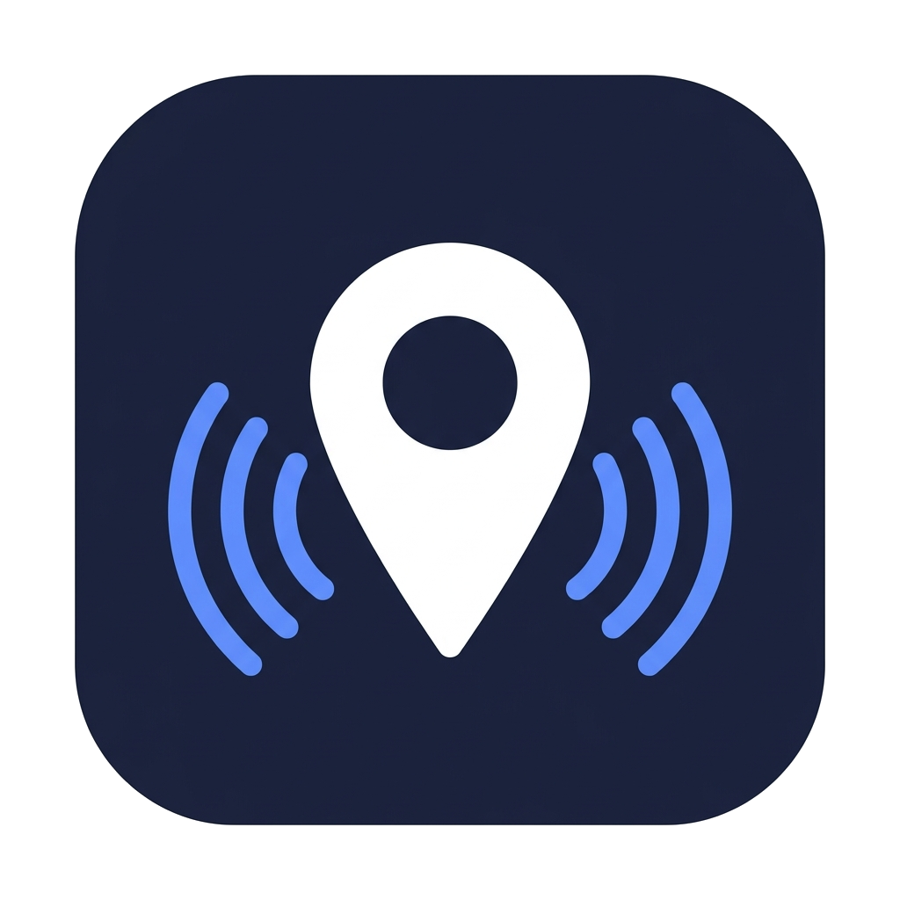

<div align="center">



# GPS Tracker

**Real-time location monitoring system based on Bluetooth Low Energy and GPS**

[](LICENSE)
[](main.c)
[](https://www.nordicsemi.com)
[](https://www.nordicsemi.com/Products/nRF52840)
[](https://tracker.muhandisd.uz)
[](https://t.me/gps_tracker_alert_bot)

[Live Demo](https://tracker.muhandisd.uz) · [Telegram Bot](https://t.me/gps_tracker_alert_bot) · [Report Bug](https://github.com/Karimov-Akbar/Tracking-system/issues)

</div>

---

## 📋 Table of Contents

- [About](#-about)
- [Features](#-features)
- [System Architecture](#-system-architecture)
- [Hardware](#-hardware)
  - [Components](#components)
  - [BLE GATT Service](#ble-gatt-service)
  - [Wiring](#wiring)
- [Firmware](#-firmware)
  - [Project Structure](#project-structure)
  - [Build Instructions](#build-instructions)
- [Dashboard](#-dashboard)
- [Server & Telegram Bot](#-server--telegram-bot)
  - [Setup](#setup)
  - [Bot Commands](#bot-commands)
  - [API Endpoints](#api-endpoints)
- [Getting Started](#-getting-started)
- [License](#-license)

---

## 🛰 About

GPS Tracker is an open-source, end-to-end location monitoring system built around the **Nordic nRF52840** microcontroller and **u-blox NEO-6M** GPS module. It transmits live coordinates over **Bluetooth Low Energy** directly to any Web Bluetooth-capable browser — no mobile app required.

The web dashboard connects to the tracker, displays position on an interactive map, supports geofences, heatmaps, and GPX export. A **Telegram bot** delivers instant alerts when a device leaves a geofence or disconnects.

> 🎓 Developed as a Bachelor's thesis project at **Kimyo International University in Tashkent (KIUT)**, Direction: *Information System Engineering*.

---

## ✨ Features

| Category | Feature |
|---|---|
| 📡 **Positioning** | GPS outdoors (~2.5 m CEP), BLE RSSI radar indoors |
| 🔵 **Connectivity** | BLE 5.0 — browser connects directly via Web Bluetooth API |
| 🗺️ **Dashboard** | PWA with CartoDB dark map, real-time marker & track |
| 📍 **Geofences** | Draw polygon or circle zones → alert on enter/exit |
| 🔥 **Heatmap** | Leaflet.heat overlay, up to 3 000 points |
| 💾 **GPX Export** | Download full track with timestamps |
| 👥 **Multi-device** | Monitor up to 10 devices simultaneously (colour-coded) |
| 🏢 **Indoor mode** | RSSI-based radar view when GPS is unavailable |
| 🔍 **BLE Scanner** | Tracker scans nearby BLE devices (phone, watch, laptop…) |
| 📲 **Telegram Bot** | Commands + auto-alerts for geofence events |
| 🔋 **Battery** | ~42 hours on 2 × 18650 Li-ion cells |
| 📂 **Open Source** | Full firmware, dashboard & server code on GitHub |

---

## 🏗 System Architecture

```
┌─────────────────────────────────────────────────────────┐
│                        DEVICE                           │
│  nRF52840 (PCA10059)  +  NEO-6M GPS  +  2×18650 cells  │
│  ┌────────────────────────────────────────────────────┐ │
│  │  BLE GATT Service (UUID 12340001-…)                │ │
│  │  ├─ CHR_LOC  0x0002  Notify  lat/lon/alt (12 B)   │ │
│  │  ├─ CHR_STS  0x0003  Read    fix/sat/speed (4 B)  │ │
│  │  ├─ CHR_SOS  0x0004  Notify  SOS alert (1 B)      │ │
│  │  └─ CHR_SCAN 0x0005  Notify  nearby BLE devices   │ │
│  └────────────────────────────────────────────────────┘ │
└────────────────────────┬────────────────────────────────┘
                         │ Bluetooth Low Energy 5.0
                         ▼
┌─────────────────────────────────────────────────────────┐
│                  BROWSER  (PWA)                         │
│  Web Bluetooth API → GATT connect → subscribe notify   │
│  Leaflet.js map  |  Radar view  |  Geofence editor     │
│                         │                              │
│              POST /api/* (HTTP)                        │
└────────────────────────┬────────────────────────────────┘
                         │
                         ▼
┌─────────────────────────────────────────────────────────┐
│               VPS  (tracker.muhandisd.uz)               │
│  Nginx (reverse proxy + SSL)  →  Node.js / Express     │
│  In-memory device store  |  chats.json subscriptions   │
│                         │                              │
│              Telegram Bot API (Long Polling)           │
└────────────────────────┬────────────────────────────────┘
                         │
                         ▼
                  📲 Telegram users
```

---

## 🔧 Hardware

### Components

| Component | Part | Notes |
|---|---|---|
| **MCU** | Nordic nRF52840 (PCA10059 dongle) | ARM Cortex-M4F, 64 MHz, BLE 5.0 |
| **GPS** | u-blox NEO-6M | NMEA 0183, UART 9600 baud, ~2.5 m CEP |
| **Battery** | 2 × 18650 Li-ion (parallel) | ~4 400 mAh total |
| **Charger** | TP4056 + BMS | CC/CV 1 A, over-discharge protection |
| **Regulator** | DC-DC Buck 3.3 V / 2–3 A | ~90% efficiency |
| **Switch** | SPST latching button | Cuts power from battery to regulator |

**Power budget (active mode):**

| Consumer | Current | Power |
|---|---|---|
| nRF52840 (BLE active) | ~6 mA | ~20 mW |
| NEO-6M GPS (tracking) | ~37 mA | ~122 mW |
| DC-DC losses | — | ~8 mW |
| **Total** | **~88 mA** | **~325 mW** |

> ⏱ Estimated runtime with 2 × 2 200 mAh cells: **~42 hours**

---

### BLE GATT Service

Base UUID: `12345678-1234-5678-1234-56789ABCDEF0`

| Characteristic | UUID | Properties | Length | Description |
|---|---|---|---|---|
| **GPS Location** | `0x0002` | Notify | 12 B | `float lat` + `float lon` + `float alt` |
| **GPS Status** | `0x0003` | Read | 4 B | `fix_valid` · `fix_quality` · `satellites` · `speed_kmh` |
| **SOS Alert** | `0x0004` | Notify | 1 B | `0x01` = SOS triggered · `0x00` = cleared |
| **BLE Scan** | `0x0005` | Notify | variable | Packed list of nearby BLE devices |

**BLE Scan packet format** (CHR_SCAN):
```
[count: 1B] [MAC: 6B] [RSSI: 1B] [type: 1B] [nameLen: 1B] [name: N B] × count
```

Device types: `0` Unknown · `1` Phone · `2` Computer · `3` Watch · `4` Headphones · `5` Speaker · `6` TV · `7` Tag · `8` Generic

---

### Wiring

```
nRF52840 PCA10059          NEO-6M GPS
─────────────────          ──────────
P0.17 (TX)        ──────►  RX
P0.15 (RX)        ◄──────  TX
GND               ──────── GND
3.3V              ──────── VCC  (from DC-DC output)
```

---

## 💾 Firmware

### Project Structure

```
Tracking-system/
├── main.c                      # Entry point — BLE stack, GPS init, timer
├── Makefile                    # Build system (nRF5 SDK + ARM GCC)
├── config/
│   ├── app_config.h            # USB CDC logging, UART, PWM config
│   └── sdk_config.h            # nRF5 SDK module enable/disable flags
├── include/
│   ├── ble_gps_service.h       # GATT service API
│   ├── ble_scan.h              # BLE scanner API (up to 30 devices)
│   ├── gps_uart.h              # UART driver for NEO-6M (P0.17 / P0.15)
│   └── nmea_parser.h           # Lightweight GPRMC + GPGGA parser
├── src/
│   ├── ble_gps_service.c       # GATT characteristics implementation
│   ├── ble_scan.c              # Passive/active BLE scanning, Apple detection
│   ├── gps_uart.c              # UART FIFO + NMEA line assembly
│   └── nmea_parser.c           # Checksum validation, coordinate conversion
└── pca10059/
    └── s140/armgcc/            # Linker script for SoftDevice S140 v7.2.0
```

**Key constants in `main.c`:**

```c
#define DEVICE_NAME          "GPS Tracker"   // BLE advertising name
#define APP_ADV_INTERVAL     300             // 187.5 ms advertising interval
#define APP_ADV_DURATION     18000           // 180 s advertising window
#define GPS_UPDATE_INTERVAL  APP_TIMER_TICKS(1000)  // 1 s GATT notify rate
```

**Position caching logic** — when GPS fix is lost, the last known coordinates are forwarded with `fix_valid = 0` so the dashboard can display a *stale position* indicator instead of an empty map:

```c
if (gps_data.fix_valid) {
    last_good_position = gps_data;   // cache valid fix
    has_cached_position = true;
} else if (has_cached_position) {
    gps_data.latitude  = last_good_position.latitude;
    gps_data.longitude = last_good_position.longitude;
    // fix_valid stays 0 → dashboard shows "stale" marker
}
ble_gps_service_location_update(&m_gps_service, &gps_data);
```

---

### Build Instructions

**Prerequisites:**

| Tool | Version |
|---|---|
| nRF5 SDK | 17.x |
| SoftDevice | S140 v7.2.0 |
| GNU Arm Embedded Toolchain | `arm-none-eabi-gcc` |
| nRF Command Line Tools | for flashing |

**1. Clone & set SDK path:**

```bash
git clone https://github.com/Karimov-Akbar/Tracking-system.git
cd Tracking-system
# Edit Makefile — set SDK_ROOT to your nRF5 SDK location:
# SDK_ROOT ?= /path/to/nRF5_SDK_17.x
```

**2. Flash SoftDevice:**

```bash
nrfjprog --program path/to/s140_nrf52_7.2.0_softdevice.hex --chiperase
```

**3. Build & flash firmware:**

```bash
make
make flash
```

**4. View logs (USB CDC):**

```bash
# Linux / macOS
screen /dev/ttyACM0 115200

# Windows — use PuTTY on the virtual COM port
```

---

## 🌐 Dashboard

The dashboard is a **Progressive Web App** hosted at [`tracker.muhandisd.uz`](https://tracker.muhandisd.uz).  
It connects directly to the tracker via **Web Bluetooth API** — no intermediate server, no app installation.

**Supported browsers:** Chrome 85+, Edge 85+, Opera 71+  
*(Safari and Firefox do not support Web Bluetooth)*

**How to connect:**
1. Open [tracker.muhandisd.uz](https://tracker.muhandisd.uz) on a supported browser
2. Click **"Добавить устройство"** (Add device)
3. Select **"GPS Tracker"** from the Bluetooth picker
4. Done — position appears on the map within seconds

**Dashboard features:**

| Feature | Details |
|---|---|
| 🗺️ **Map (outdoor)** | Leaflet.js 1.9.4, CartoDB dark tiles |
| 📡 **Radar (indoor)** | RSSI → estimated distance, polar display |
| 🛡️ **Geofences** | Circle (radius in metres) or freehand polygon, saved to `localStorage` |
| 🔥 **Heatmap** | `leaflet.heat`, up to 3 000 points |
| 📥 **GPX Export** | GPX 1.1 format with timestamps, up to 1 000 track points |
| 🔍 **BLE Scanner** | Lists nearby devices via CHR_SCAN; add to map as tracked objects |
| 🔄 **Auto-reconnect** | Up to 3 attempts with exponential back-off (2–6 s) |

---

## 📡 Server & Telegram Bot

### Setup

```bash
cd server
cp .env.example .env
# Edit .env:
# BOT_TOKEN=your_telegram_bot_token
# PORT=3001
# TRACKER_URL=https://your-domain.com

npm install
npm start
```

**Environment variables:**

| Variable | Description |
|---|---|
| `BOT_TOKEN` | Telegram bot token from [@BotFather](https://t.me/BotFather) |
| `PORT` | HTTP server port (default: `3001`) |
| `TRACKER_URL` | Public URL of the dashboard |

**Recommended Nginx config snippet:**
```nginx
location /api/ {
    proxy_pass http://127.0.0.1:3001;
}
```

**Device timeout:** if no data is received for **130 seconds**, the device is considered offline and removed from memory.

---

### Bot Commands

| Command | Description |
|---|---|
| `/start` | Subscribe to notifications + dashboard link |
| `/status` | Status of all active devices (coords, satellites, fix) |
| `/devices` | List of active devices with mode (GPS / BLE / indoor) |
| `/location` | Send Telegram Location for each active GPS device |
| `/stop` | Unsubscribe from notifications |

**Automatic alerts** are sent to all subscribers when:

- 🚨 A device **exits** a geofence zone (with coordinates + Google Maps link)
- ✅ A device **enters** a geofence zone
- 🔌 A device **disconnects**
- 📌 A nearby BLE device is **added / removed / renamed**

---

### API Endpoints

| Method | Endpoint | Description |
|---|---|---|
| `POST` | `/api/location` | Update device coordinates & status |
| `POST` | `/api/disconnect` | Device disconnected — notify subscribers |
| `POST` | `/api/geofence` | Geofence enter/exit event |
| `POST` | `/api/track` | BLE device add/remove/rename event |
| `GET` | `/api/health` | Server health: subscribers, active devices |

All endpoints are called automatically by the browser dashboard — no manual interaction required.

---

## 🚀 Getting Started

**Full system setup in 3 steps:**

```
1. Flash firmware onto nRF52840
        ↓
2. Deploy server on a VPS (or run locally)
        ↓
3. Open tracker.muhandisd.uz → Add device → Done
```

**Minimal local test (no VPS needed):**
```bash
# 1. Run server locally
cd server && npm install && BOT_TOKEN=xxx npm start

# 2. Open dashboard/index.html in Chrome
# 3. Click "Add device" and pair with the tracker
```

---

## 📊 Project Stats

| Component | Language | Lines |
|---|---|---|
| Firmware (`main.c` + `src/`) | C | ~2 400 |
| Dashboard (`dashboard/assets/scripts/`) | JavaScript | ~1 130 |
| Server (`server/bot.js`) | Node.js | ~240 |

---

## 📄 License

This project is licensed under the **MIT License**.  
Feel free to fork, modify and use in your own projects.

---

<div align="center">

Made with ❤️ at **Kimyo International University in Tashkent**  
Direction: *Information System Engineering*

**[⬆ Back to top](#gps-tracker)**

</div>
